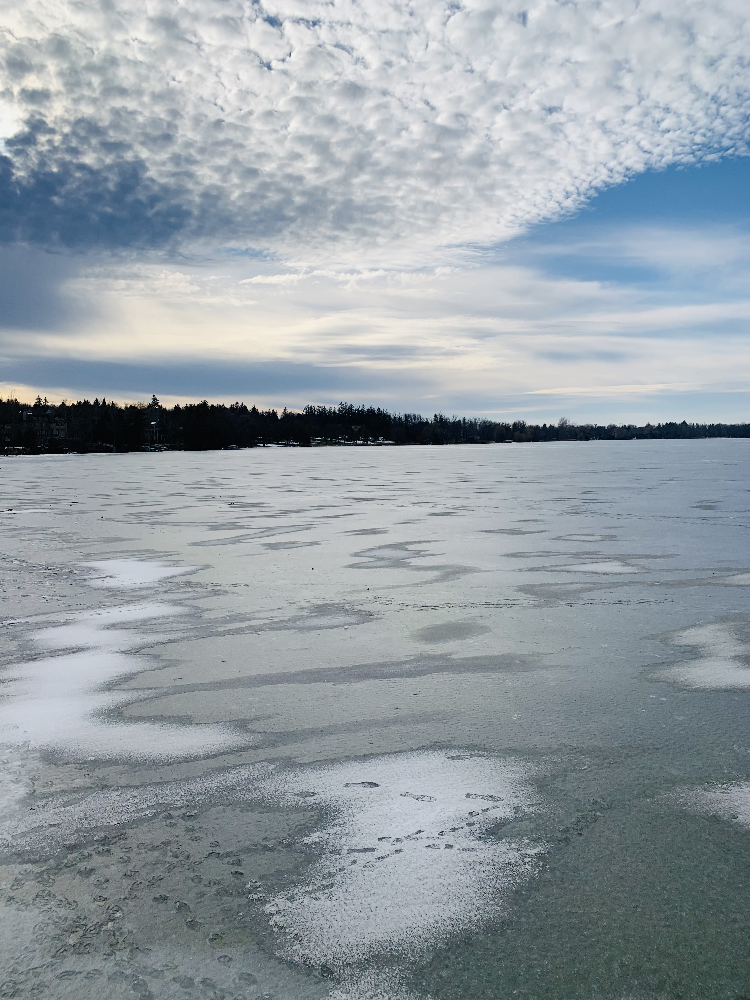

# A long-term database on ice phenology of lakes around the world

### Collaborators and Contributors

- Sapna Sharma
- Thi Nguyen, 
- Alessandro Filazzola 
- M. Arshad Imrit
- Kevin Blagrave
- Damien Bouffard 
- Julia Daly
- Harley Feldman
- Natalie Felsine
- Harrie-Jan Hendricks-Franssen
- Nikolay Granin
- Richard Hecock
- Jan Henning L’Abée-Lund
- Ed Hopkins
- Tom Hoverstad
- Neil Howk
- Paulette Janssen
- Johanna Korhonen
- Hilmar J. Malmquist
- Wlodzimierz Marszelewski
- Shin-Ichiro Matsuzaki
- Yuichi Miyabara
- Kiyoshi Miyasaka
- Alexander Mills
- Joe Norton
- Lolita Olson
- Ted Peters
- David C. Richardson
- Dale Robertson
- Lars Rudstam
- Tom Skramstad
- Larry Smisek
- Danielle Wain
- Holly Waterfield
- Gesa Weyhenmeyer
- Brendan Wiltse
- Huaxia Yao
- Andry Zhdanov
- John J. Magnuson

### Description
Lake ice is an important resource supporting water quality, local biodiversity, arctic transportation, and regional economies ([Knoll et al. 2019](https://aslopubs.onlinelibrary.wiley.com/doi/abs/10.1002/lol2.10116)). However, many studies have identified the threat of climate change on the long-term persistence of lake ice ([Magnuson et al. 2000](https://www.science.org/doi/abs/10.1126/science.289.5485.1743); [Livingstone et al. 2009](https://link.springer.com/chapter/10.1007/978-90-481-2945-4_4); [Sharma et al. 2019](https://www.nature.com/articles/s41558-018-0393-5); [Filazzola et al. 2020](https://agupubs.onlinelibrary.wiley.com/doi/abs/10.1029/2020GL089608); [Sharma et al. 2021](https://agupubs.onlinelibrary.wiley.com/doi/10.1029/2021JG006348)). Long-term surveys of lake ice collected in situ are the gold standard for monitoring in environmental science ([Filazzola & Cahill 2021](https://besjournals.onlinelibrary.wiley.com/doi/abs/10.1111/2041-210X.13657)). Here, we present ice phenology records for 78 lakes in the Northern Hemisphere spanning up to 578 years. These surveys include 12 different countries across North America and Eurasia collected by researchers, community scientists, priests, and digital observations. This database includes information about ice phenology (ice-on dates, ice-off dates, ice cover duration), lake characteristics (e.g., size, location, names), and meta-data about each data source (e.g., how the data was collected). Our intention is that this database may be used to understand factors driving lake ice patterns and the biological or socio-economic consequences.  

### Data

The data within this database are separated into three main files
- *PhenologyData.csv*: has the lake ice phenology for all 478 lakes.
- *LakeCharacteristics.csv*: has the physical characteristics and coordinates of the lakes in the database.
- *Definitions.csv*: the meta-data associated with each lake including the range of the time series, number of missing observations, and definitions of ice-on/ice-off. 

### Scripts

The *qaqc.r* file was used for converting *78_lakes_ts_minimal.csv* into "long" format where only one each column represents ice on and ice off dates. The *qaqc.r* file also performs some basic quality control and assurance of the dataset. There are two source files, *create_lake_ice_time_series.py* and *additional_functions.py* that consolated lake names, conduct some quality control, and were responsible for the original data aggregation across multiple files. 

